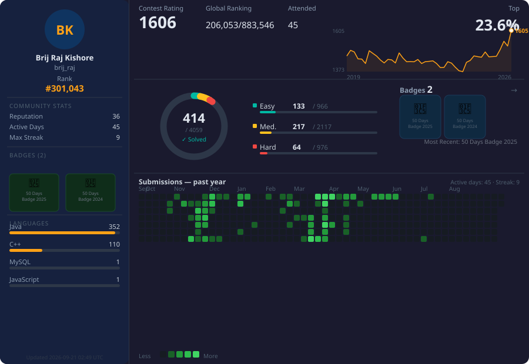

<!-- ════════════════════ HERO ════════════════════ -->

<p align="center">
  
</p>

<p align="center">
  <a href="https://git.io/typing-svg">
    
  </a>
</p>

<p align="center">
  <a href="assets/Brij_Raj_Kishore_Resume.pdf"></a>
  <a href="https://www.linkedin.com/in/brijrajkishore/"></a>
  <a href="mailto:brijraj31@gmail.com"></a>
  <a href="https://leetcode.com/u/brij_raj/"></a>
  <a href="https://github.com/brijrajk"></a>
</p>

<!-- ── Signature block: a self-profile only an engine/profiler person would write ── -->

```sql
EXPLAIN ANALYZE SELECT focus FROM brij_raj_kishore;

══ Physical Plan ════════════════════════════════════════════════════════════
LLMInferenceAccelerate                           ▏ ◄ primary focus
├─ PyTorchOOTBackend  [dispatch · kernels · device mem · streams]
│    └─ OpInfo coverage → ran Llama & BERT end-to-end
├─ CUDAParityHarness  [self-built correctness framework]
├─ vLLMServing        [device plugin .to() / streams · in progress]
└─ FPGA / Xilinx      [hardware-level execution]

QueryEngineRoots      [Spark → Velox → Gluten]   ▏ foundation · 5× faster, native
   └─ same instincts:  kernels, native code, hardware, profiling

Proof:      12 PRs merged across 8 upstream repos
Optimizer:  "make it correct, then make it fly."   ⚡
```

---

<!-- ════════════════════ LIVE DASHBOARD ════════════════════ -->

## 📊 Live Dashboard

<!-- SCOREBOARD_START -->
<p align="center">
  <a href="https://github.com/search?type=pullrequests&q=is%3Apr+author%3Abrijrajk+is%3Amerged"></a>
  <a href="https://github.com/search?type=pullrequests&q=is%3Apr+author%3Abrijrajk+is%3Aopen"></a>
  <a href="https://github.com/search?type=pullrequests&q=is%3Apr+author%3Abrijrajk"></a>
</p>
<!-- SCOREBOARD_END -->

<p align="center">
  
  
  
  
</p>

<p align="center">
  <i>Contributing to the LLM &amp; data engines I accelerate — click any logo to see all my PRs there:</i>
</p>

<!-- MERGEDLOGOS_START -->
<p align="center">
  <a href="https://github.com/pytorch/pytorch/pulls?q=is%3Apr+author%3Abrijrajk"></a>
  <a href="https://github.com/vllm-project/vllm/pulls?q=is%3Apr+author%3Abrijrajk"></a>
  <a href="https://github.com/apache/spark/pulls?q=is%3Apr+author%3Abrijrajk"></a>
  <a href="https://github.com/facebookincubator/velox/pulls?q=is%3Apr+author%3Abrijrajk"></a>
  <a href="https://github.com/apache/gluten/pulls?q=is%3Apr+author%3Abrijrajk"></a>
</p>
<!-- MERGEDLOGOS_END -->

<table align="center">
<tr>
<td width="50%">
  
</td>
<td width="50%">
  
</td>
</tr>
</table>

<p align="center">
  
</p>

<p align="center">
  
</p>

---

<!-- ════════════════════ THE PROOF ════════════════════ -->

## 🌍 The Proof — Open Source Contributions

> The fastest way to know how I write and review code: read the diffs. Real PRs — correctness bugs, performance, features — in the engines that power production Big Data and AI. Every **✅ Merged** was approved by that project's own maintainers.

> ✅ Merged · 🔄 Open · ❌ Closed without merge

<!-- CONTRIBUTIONS_START -->
### 🤖 PyTorch
| PR | Description | Status |
|----|-------------|--------|
| [#185694](https://github.com/pytorch/pytorch/pull/185694) | [library] Improve infer_schema error message when future annotations cause NameError | ✅ Merged |
| [#187861](https://github.com/pytorch/pytorch/pull/187861) | [nn] Raise ValueError for norm_type=0 in lp_pool{1,2,3}d and LPPoolNd | ✅ Merged |
| [#188167](https://github.com/pytorch/pytorch/pull/188167) | [c10][cuda] Restore current device via RAII on the throwing path in CUDAGuardImpl | ✅ Merged |
| [#185756](https://github.com/pytorch/pytorch/pull/185756) | [clamp] Fix float16 scalar overflow check inconsistency between CPU and GPU | 🔄 Open |
| [#185751](https://github.com/pytorch/pytorch/pull/185751) | [nn] Raise ValueError early for invalid (ndim, pad_size) in non-constant F.pad modes | 🔄 Open |
| [#187908](https://github.com/pytorch/pytorch/pull/187908) | [fix] torch.where silently overflows fp16 scalars (issue #187429) | 🔄 Open |

### ⚡ vLLM
| PR | Description | Status |
|----|-------------|--------|
| [#44349](https://github.com/vllm-project/vllm/pull/44349) | [Tests] Gate Step3VL under Transformers v5 | 🔄 Open |

### 🚀 Apache Gluten
| PR | Description | Status |
|----|-------------|--------|
| [#12199](https://github.com/apache/gluten/pull/12199) | [MINOR][VL] Re-enable stale ignored atan2 test in MathFunctionsValidateSuite | ✅ Merged |
| [#12333](https://github.com/apache/gluten/pull/12333) | [GLUTEN-11539][VL] Improve error message for unsupported spark.io.compression.codec in native shuffle | ✅ Merged |
| [#12335](https://github.com/apache/gluten/pull/12335) | [GLUTEN-10992][VL] Fix MatchError for KeyGroupedPartitioning in native shuffle | ✅ Merged |
| [#12360](https://github.com/apache/gluten/pull/12360) | [GLUTEN-11539][VL] Improve error message when spark.io.compression.codec=none | ✅ Merged |
| [#12151](https://github.com/apache/gluten/pull/12151) | [GLUTEN-12013][VL] Fix bloom-filter bytes corruption on whole-stage AQE fallback | 🔄 Open |
| [#12158](https://github.com/apache/gluten/pull/12158) | [GLUTEN-12157][VL] Fix silently-skipped math/scalar test suites; add Velox native tests for sin, tan, tanh, radians, ln | 🔄 Open |
| [#12332](https://github.com/apache/gluten/pull/12332) | [GLUTEN-12260][VL] Fix CheckOverflowTransformer passing wrong child dataType | ❌ Closed |
| [#12374](https://github.com/apache/gluten/pull/12374) | [UT][VL] Refresh TPC-H q19 plan stability golden file | ❌ Closed |

### 🧠 Velox
| PR | Description | Status |
|----|-------------|--------|
| [#17668](https://github.com/facebookincubator/velox/pull/17668) | perf(tpcds): Eliminate redundant map allocations in toTableName and fromTableName | ✅ Merged |
| [#17669](https://github.com/facebookincubator/velox/pull/17669) | feat: Register Spark transform_values function | ✅ Merged |
| [#17675](https://github.com/facebookincubator/velox/pull/17675) | docs(geospatial): Expand convex_hull_agg and geometry_union_agg docs | ✅ Merged |
| [#17676](https://github.com/facebookincubator/velox/pull/17676) | docs: Fix duplicate object description warnings in Sphinx doc build | ✅ Merged |
| [#17677](https://github.com/facebookincubator/velox/pull/17677) | test(parquet): Verify WriterOptions::encoding is forwarded to Arrow writer | ✅ Merged |

### 🔥 Apache Spark
| PR | Description | Status |
|----|-------------|--------|
| [#56154](https://github.com/apache/spark/pull/56154) | [SPARK-49798][DOCS] Fix inaccurate documentation of RuntimeConfig.get | ✅ Merged |
| [#56248](https://github.com/apache/spark/pull/56248) | [SPARK-34679][DOCS] Add inferTimestamp option to JSON data source options table | ✅ Merged |
| [#56469](https://github.com/apache/spark/pull/56469) | [SPARK-57418][DOCS] Add singleVariantColumn option to CSV, JSON, and XML data source options tables | ✅ Merged |
| [#56174](https://github.com/apache/spark/pull/56174) | [SPARK-43847][PYTHON] Throw structured error when reading Protobuf descriptor file fails | 🔄 Open |
| [#56178](https://github.com/apache/spark/pull/56178) | [SPARK-40437][SS][PYTHON] Support string representation of durationMs in GroupState.setTimeoutDuration | 🔄 Open |
| [#56473](https://github.com/apache/spark/pull/56473) | [SPARK-56367][SS][PYTHON][DOCS] Fix latestOffset docstring, update tutorial signature, and add Trigger.AvailableNow documentation | 🔄 Open |
| [#56673](https://github.com/apache/spark/pull/56673) | [SPARK-43322][SQL] Document null/empty behavior in explode_outer and posexplode_outer | 🔄 Open |
| [#56675](https://github.com/apache/spark/pull/56675) | [SPARK-47013][SS] Document spark.sql.streaming.minBatchesToRetain config | 🔄 Open |
| [#56250](https://github.com/apache/spark/pull/56250) | [SPARK-56561][PYTHON][DOCS] Document order preservation for array_distinct, array_intersect, array_union, array_except | ❌ Closed |

### 📦 aws-samples/aws-etl-orchestrator
| PR | Description | Status |
|----|-------------|--------|
| [#9](https://github.com/aws-samples/aws-etl-orchestrator/pull/9) | Migrate to Python3.12 | 🔄 Open |

### 📦 duckdb/duckdb
| PR | Description | Status |
|----|-------------|--------|
| [#23363](https://github.com/duckdb/duckdb/pull/23363) | Fix *COLUMNS() false rejection when operators appear in lambda bodies | 🔄 Open |
| [#23366](https://github.com/duckdb/duckdb/pull/23366) | Fix *COLUMNS() false rejection when operator wraps function result | 🔄 Open |
| [#23104](https://github.com/duckdb/duckdb/pull/23104) | Fix *COLUMNS() false rejection when operators appear in lambda bodies | ❌ Closed |

### 📦 google/it-cert-automation-practice
| PR | Description | Status |
|----|-------------|--------|
| [#2336](https://github.com/google/it-cert-automation-practice/pull/2336) | Closes: #1 | 🔄 Open |

<!-- CONTRIBUTIONS_END -->

---

## 🔬 Bugs Worth Reading — Both Tracks

Volume is cheap. Here's the kind of problem I actually chase down — the bug that hides behind a green CI run — across both the query-engine and LLM/GPU sides:

| Track | Where | What I found &amp; fixed |
|-------|-------|----------------------|
| 🤖 LLM / GPU | **[PyTorch #188167](https://github.com/pytorch/pytorch/pull/188167)** | A throw inside a CUDA op could leave the **current device switched** — silently corrupting state for every kernel that ran after it. Fixed with RAII so the device is always restored on the error path. |
| 🤖 LLM / GPU | **[PyTorch #185756](https://github.com/pytorch/pytorch/pull/185756)** | `clamp` **accepted an fp16-overflowing scalar on CPU but rejected it on GPU** — a silent cross-device numeric divergence. Tracked down the inconsistent overflow check and aligned both backends. |
| 🚀 Query | **[Gluten #12151](https://github.com/apache/gluten/pull/12151)** | A whole-stage transform falling back to vanilla Spark mid-query **silently corrupted serialized bloom-filter bytes**. Root-caused the native↔JVM lifecycle mismatch and fixed the byte handoff. |
| 🚀 Query | **[Velox #17668](https://github.com/facebookincubator/velox/pull/17668)** | Killed redundant per-call map allocations in `toTableName`/`fromTableName` on a **hot path hit across the entire TPC-DS suite**. |

---

## 🧭 Focus — LLM Inference Acceleration

Currently building the **systems layer that makes LLM inference fast on custom hardware** as **Senior MTS @ [Zettabolt](https://www.zettabolt.com)** — from the PyTorch dispatcher down to the FPGA:

- 🧩 **PyTorch OOT device backend** — operator dispatch, kernel registration, device memory management, and streams for a custom accelerator
- ✅ **Full OpInfo operator coverage** — ran **Llama & BERT inference end-to-end** on the custom device
- 🛡️ **CUDA-parity testing framework** I built — validates backend operators against the CUDA reference in CI
- 🚄 **vLLM serving** — extending the device plugin to vLLM (device `.to()`, streams, operator/kernel integration)
- 🎯 **GPU / CUDA correctness & numerics** across backends (see the device-guard and fp16 bugs above)
- ⚡ **100× PageRank speedup** integrating NVIDIA CUDA (C++) with TigerGraph — GPU-acceleration instincts that transfer straight to inference
- 🔌 **FPGA / Xilinx** — pushing execution into hardware

> **The foundation that makes me good at it — 5+ years deep in production query engines:** I drove a **5× Spark speedup** (Neuroblade SPU, since acquired by AWS) — 2× over Apache Gluten — by offloading Scan/Filter/Aggregation to hardware via Velox; delivered another **5× on AMD EPYC** integrating AMD AOCL with Gluten/Velox; and built **ZettaProf**, a Spark profiler that cut debug time **60%**. LLM inference acceleration demands the *exact same instincts* — native code, kernels, hardware, relentless profiling. I'm bringing query-engine rigor to the transformer stack.

🎓 M.Tech CS, **NIT Nagpur** &nbsp;·&nbsp; 🌍 Noida, Delhi/NCR, India &nbsp;·&nbsp; **Upstream** (forks I work in): [`pytorch/pytorch`](https://github.com/brijrajk/pytorch) · [`vllm-project/vllm`](https://github.com/vllm-project/vllm) · [`apache/gluten`](https://github.com/brijrajk/incubator-gluten) · [`facebookincubator/velox`](https://github.com/brijrajk/facebook-velox) · [`apache/spark`](https://github.com/brijrajk/spark)

---

## 🛠️ Stack

**LLM / Inference** &nbsp; PyTorch (OOT device backend · dispatch · kernels · OpInfo · streams) · vLLM serving · CUDA-parity testing · NVIDIA CUDA · cuGraph
**Languages** &nbsp; `C++` · `C` · `Python` · `Scala` · `Java`
**Bare Metal / Hardware** &nbsp; FPGA (Xilinx/AMD) · AMD EPYC/AOCL · GDB · Valgrind · uProf · CMake · Ninja
**Query Engines** *(foundation)* &nbsp; Apache Spark · Velox · Gluten · Hive · Hadoop · Kafka · Arrow/Parquet
**Cloud & Observability** &nbsp; AWS · Microsoft Fabric · Azure Data Factory · Docker · Linux · Flamegraph · Grafana · Netdata

<details>
<summary>🏆 Achievements · 📈 detailed metrics · LeetCode · contribution snake</summary>

<br/>

- 🥇 **GATE CSE 2019** — 97th percentile
- 💻 **Google Code Jam 2020** — Rank 6448 / 44,434
- 🧠 **TCS CodeVita 2016** — 414 AIR (Round 1) · 1st & 2nd college rank
- ⚙️ Earlier: **NXP Semiconductors** (Bluetooth/WiFi firmware in C) · **TCS** (POS REST APIs)

<p align="center">
  
</p>

<!-- LEETCODE_STATS_START -->
<p align="center">
  
</p>
<!-- LEETCODE_STATS_END -->

<p align="center">
  
</p>

</details>

---

<p align="center">
  <b>Open to conversations on Big Data infrastructure, accelerated computing &amp; LLM systems.</b>
</p>

<p align="center">
  <a href="https://www.linkedin.com/in/brijrajkishore/"></a>
  &nbsp;
  <a href="mailto:brijraj31@gmail.com"></a>
</p>

<p align="center">
  
</p>
